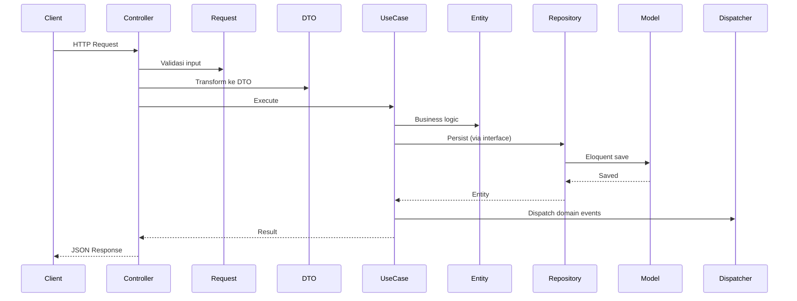

# Architecture

## Overview

Proyek ini menggunakan **Clean Architecture** dengan pendekatan **Domain-Driven Design (DDD)**. Tujuan utamanya adalah memisahkan business logic dari framework dan infrastructure concerns, sehingga kode lebih terawat, di-test, dan mudah dikembangkan.

```
src/
├── Domain/           # Business logic & rules
├── Application/      # Use cases & DTOs
├── Infrastructure/   # Database, framework, external services
├── Presentation/     # HTTP layer (controllers, requests)
└── Shared/           # Shared value objects & cross-cutting concerns
```

---

## Layer Responsibilities

### Domain

Layer paling dalam. Tidak bergantung pada framework atau database apapun.

```
src/Domain/{Module}/
├── Entities/         # Business entities dengan behaviour
├── ValueObjects/     # Immutable value objects
├── Repositories/     # Interface saja (contract)
├── Events/           # Domain events
└── Exceptions/       # Domain-specific exceptions
```

**Aturan:**
- Entities berisi behaviour, bukan getter/setter saja
- ValueObjects immutable — `readonly` class
- Repository hanya interface, implementasi di Infrastructure
- Tidak ada import dari Laravel atau framework

Contoh entity:

```php
final class Beneficiary
{
    public function __construct(
        private DomainId $id,
        private NationalIdentityNumber $nik,
        private BeneficiaryType $type,
        private PersonName $fullName,
        // ...
    ) {}

    public static function register(
        NationalIdentityNumber $nik,
        BeneficiaryType $type,
        PersonName $fullName,
        // ...
    ): self {
        // Business logic & validation
    }

    public function rename(PersonName $fullName, PersonName $nickName): void
    {
        // Behaviour, bukan setter biasa
    }
}
```

### Application

Koordinasi antara Domain dan Infrastructure. Setiap UseCase mewakili satu action bisnis.

```
src/Application/{Module}/
├── UseCases/         # Satu class per action
└── DTOs/             # Data Transfer Objects (Spatie LaravelData)
```

Contoh use case:

```php
final readonly class RegisterBeneficiaryUseCase
{
    public function __construct(
        private BeneficiaryRepositoryInterface $beneficiaries,
        private FamilyCardRepositoryInterface $familyCards,
        private Dispatcher $events,
    ) {}

    public function handle(RegisterBeneficiaryData $data): Beneficiary
    {
        // 1. Validasi domain
        // 2. Orchestrasi entity & repository
        // 3. Dispatch domain events
        // 4. Return result
    }
}
```

### Infrastructure

Implementasi konkret dari repository interface. Berurusan dengan database, framework, dan external services.

```
src/Infrastructure/{Module}/
├── Models/           # Eloquent models
├── Migrations/       # Database migrations
├── Repositories/     # Implementasi repository interface
├── Casts/            # Custom casts
└── Providers/        # Service providers
```

ModelEloquent bertanggung jawab untuk reconstitute Entity dari database dan sebaliknya:

```php
class BeneficiaryModel extends Model
{
    use HasUlids;
    use SoftDeletes;

    protected $table = 'beneficiary';

    public function toEntity(): Beneficiary
    {
        return Beneficiary::fromPersistence(
            id: new DomainId($this->id),
            nik: new NationalIdentityNumber($this->nik),
            // ...
        );
    }
}
```

### Presentation

HTTP Layer — menerima request, meneruskan ke UseCase, mengembalikan response.

```
src/Presentation/{Module}/Http/
├── Controllers/
├── Requests/
└── Resources/
```

Controller tidak mengandung business logic. Cukup parse request, panggil use case, return response:

```php
class RegisterBeneficiaryController extends Controller
{
    public function __invoke(
        RegisterBeneficiaryRequest $request,
        RegisterBeneficiaryUseCase $useCase,
    ): JsonResponse {
        $beneficiary = $useCase->handle(
            RegisterBeneficiaryData::from($request->validated())
        );

        return response()->json([
            'message' => 'Beneficiary registered',
            'data' => $beneficiary->toArray(),
        ], 201);
    }
}
```

### Shared

Kode yang digunakan bersama oleh semua module.

```
src/Shared/
├── ValueObjects/     # DomainId, Address, Person, Contact, Gender
├── Exceptions/       # EntityNotFoundException, InvalidIdentifierException
├── Casts/            # AddressCast
├── Events/           # Base event classes
└── Console/          # Shared artisan commands
```

---

## Request Flow



---

## Module Autodiscovery

Module didaftarkan di `config/modules.php`:

```php
'enabled' => [
    'Beneficiary',
    'Organization',
],
```

`ModulesServiceProvider` otomatis meregister provider setiap module:

```php
// app/Providers/ModulesServiceProvider.php
foreach (config('modules.enabled') as $module) {
    $provider = "Infrastructure\\{$module}\\Providers\\{$module}ServiceProvider";
    $this->app->register($provider);
}
```

**Catatan:** `Organization` terdaftar tapi belum diimplementasi. Hanya `Beneficiary` yang aktif.

---

## Audit Log

Audit adalah cross-cutting infrastructure, bukan domain module. Berdiri sendiri dan tidak melalui autodiscovery.

```
src/Infrastructure/Audit/
├── Concerns/Auditable.php      # Trait — pasang di Eloquent Model
├── Models/AuditLogModel.php    # Query log
├── Migrations/                 # create_audit_logs_table
└── Providers/                  # Registered di AppServiceProvider
```

Cara pakai:

```php
use Infrastructure\Audit\Concerns\Auditable;

class BeneficiaryModel extends Model
{
    use Auditable;
    // ...
}
```

Setiap `created` / `updated` / `deleted` otomatis tercatat di tabel `audit_logs`.

---

## Module Directory Structure

Setiap module mengikuti struktur seragam:

```
src/
├── Domain/{Module}/
│   ├── Entities/
│   ├── ValueObjects/
│   ├── Repositories/        (interface)
│   ├── Events/
│   └── Exceptions/
├── Application/{Module}/
│   ├── UseCases/
│   └── DTOs/
├── Infrastructure/{Module}/
│   ├── Models/
│   ├── Migrations/
│   ├── Repositories/        (implementasi)
│   ├── Casts/
│   └── Providers/
└── Presentation/{Module}/
    └── Http/
        ├── Controllers/
        ├── Requests/
        └── Resources/
```

Module aktif saat ini:

| Module | Status | Deskripsi |
|--------|--------|-----------|
| Beneficiary | ✅ | Manajemen penerima manfaat |
| Organization | ⏳ | Belum implementasi |
